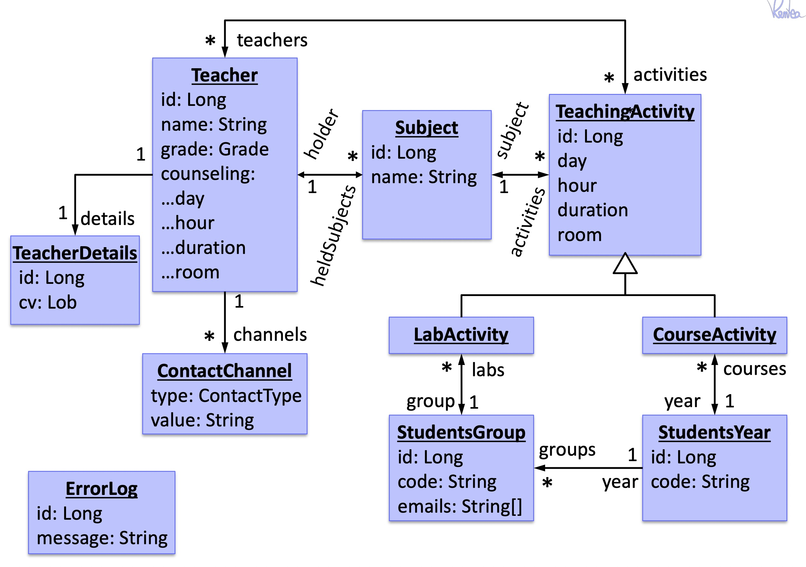

# JPA Training 
http://victorrrentea.ro

### Assignment
First, start up the in-memory database by running `StartDatabase.java`.
Everytime you run this program, the old database contents is destroyed (data, tables, FKs...)

You can then connect to it from your favourite DB manager (including IntelliJ Database view)
, using:
- connection string `jdbc:h2:tcp://localhost:9092/~/test`
- user `sa`
- password `sa`
- driver H2

Then, try to add all necessary JPA annotations to make the java model persist, 
inspecting the contents of the database regularly to check the tables + links are ok

This is the overall conceptual model: 

Also, if you prefer solving the exercise on a paper,
you can print [this pdf](printable.pdf)

## Hints
Stuff to use
- @Embeddable
- @Id
- @GeneratedValue
- @ElementCollection
- @Inheritance
- @OneToMany
- @JoinColumn
- ...

## Tradeoffs and Debates
What are the design alternatives you see?

What are the tradeoffs of each ?

